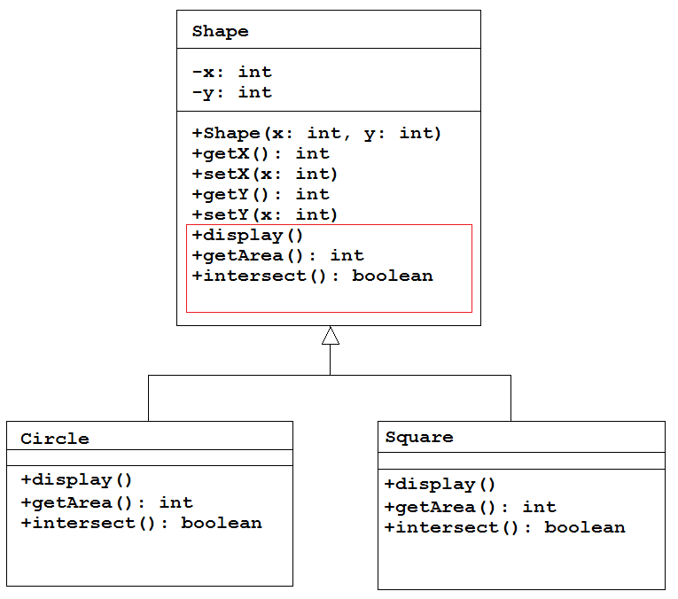
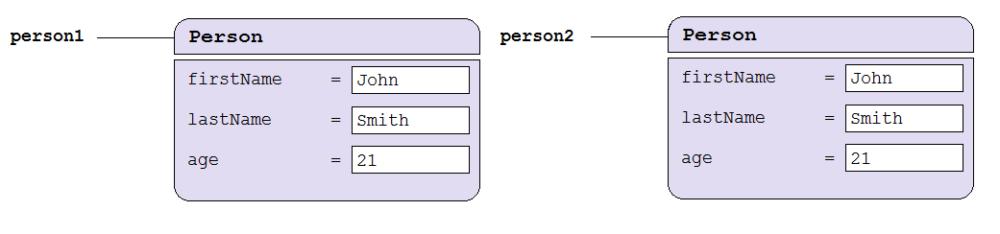
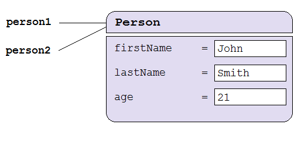

# Abstract Classes

## Contents

- [Abstract Classes](#abstract-classes-1)
- [equals() Method](#equals-method)

## Abstract Classes

To understand the concept of *abstract classes* let's look at the ``Shape``, ``Circle`` and ``Square`` classes again.  



Specifically, let's look at the ``Shape`` superclass.  It has:
-	two variables
-	a constructor
-	some getters and setters
-	a number of methods that must be overridden in the subclasses

Beyond the variables and constructor it doesn't have any specific behaviour or functionality. It simply guarantees that each subclass will have the same set of basic variables.  It is an incomplete class and must be extended to be useful.  You cannot create a ``Shape`` object and use it.   In fact, you do not want anyone to instantiate a ``Shape`` object. This problem can be resolved by making it an *abstract class*.

The keyword ``abstract`` tells the compiler this thing is incomplete and needs to be extended to be used.  The keyword ``abstract`` at the start of a class means zero or more of its methods are abstract.  An abstract method has no body.  It's purpose is to *force* a subclass to override it and provide the implementation of it.  

So, we declare the generic ``Shape`` class as an abstract class.  We declare ``Shape`` abstract because there is no such thing as a generic shape.  There can only be specific shapes such as squares, circles, triangles etc.

Now, the code for ``Shape`` would look like this:

```java
public abstract class Shape 
{
  private int x;
  private int y;
  
  public Shape (int x, int y) 
  {
    this.x=x;
    this.y=y;
  }

  public int getX()
  {
    return x;
  }
  
  public int getY()
  {
    return y;
  }  
  
  public abstract double getArea();  
  public abstract void display();  
  public abstract boolean intersect(int x, int y);
  
}

```

Above, the following are declared abstract:
-	the ``Shape`` class
-	the methods ``getArea()``, ``display()`` and ``intersect()``

Notice how an abstract method is a method with only a signature and no implementation code.  Any subclasses that extend ``Shape`` are now being forced to override and implement these abstract methods.  For example, this is the code in the ``Square`` class:

```java
public class Square extends Shape 
{
  private int length;

  public Square(int x, int y, int length) 
  {
    super(x, y);
    this.length = length;
  }
  
  @Override
  public double getArea() 
  {
    return length*length;
  }

  @Override
  public void display()
  {
    rectMode(CENTER);
    rect(getX(), getY(), length, length);
  } 

  @Override
  public boolean intersect(int x, int y)
  {
    if (dist(x, y, getX(), getY()) < length/2)    
      return true;
    else
      return false;
  } 
}

```

There's nothing new in ``Square``.  We were overriding those abstract methods anyway.

In summary, an abstract class provides a template for further development.  The purpose of an abstract class is to provide some common behaviour to all its subclasses.  For example, in the abstract class ``Shape``, you can define abstract methods such as ``getArea()`` and ``display()``.  No implementation is possible because the actual shape is not known.  However, by specifying the signature of the abstract methods, all the subclasses are forced to use these methods' signature. The subclasses can provide the proper implementations.


## equals() Method

As mentioned earlier ([here](./Inheritance.md#method-overriding)) all Java classes inherit from the ``Object`` class - explicitly or implicitly.  

The most useful methods in ``Object`` are:

```java
public String toString();             // Returns a string representation of the object
public boolean equals(Object object); // Indicates whether some other object is "equal to" this one
protected Object clone();             // Creates and returns a copy of this object

```

It's a good idea to override these methods in your classes ``Person``, ``Circle``, ``Square``, etc.  We've already done this with ``toString()`` before.  Let's examine ``equals()`` here.


The ``String`` class overrides the ``equals()`` method and we've used it many times.  For example:

```java
String name1 = new String("tom");
String name2 = new String("mary");

if(name1.equals(name2))
  println("name1 equals name2");

```

You should write an ``equals()`` method for your classes.

The ``equals()`` method is called whenever you want to compare whether two objects that have the same **contents**.  For example the code:

```java
Person person1 = new Person("John","Smith",21);
Person person2 = new Person("John","Smith",21);

```

creates these objects:




Then we can use ``equals()`` like this:

```java
if(person1.equals(person2))
  println("person1 is equal to person2");
else
  println("person1 is NOT equal to person2");

```

Above, both objects contents are equal and thus both objects are equal.


**NOTE:**This is different from the test with the ``==`` operator, which tests whether the two references (``person1`` and ``person2``) are pointing to the same object.  For example:

```java
if(person1 == person2)
  println("person1 is equal to person2");
else
  println("person1 is NOT equal to person2");

```

Above, ``person1`` and ``person2`` are references to different objects and thus are not equal.  This condition would be true if you had done this:

```java
Person person1 = new Person("John","Smith",21);
person2 = person1;

if(person1 == person2)
  println("person1 is equal to person2");
else
  println("person1 is NOT equal to person2");

```

``person1`` and ``person2`` are references to the same object:



Above, ``person1`` and ``person2`` are references to the same object and thus are equal.


In summary:
- ``equals()`` compares the contents of objects
- ``==`` compares what the object references are pointing to


### Implement ``equals()`` method

```java
if(person1.equals(person2))
  println("person1 is equal to person2");
else
  println("person1 is NOT equal to person2");

```

For the above code to work *you* must override and write the code for the ``equals()`` method in the class ``Person``.  Java does not automatically compare the content in your classes.  

Here's our ``Person`` class with the ``equals()`` method:

```java
public class Person
{
  private String firstName;
  private String lastName;
  private int age;

  public Person(String firstName, String lastName, int age)
  {
    this.firstName = firstName;
    this.lastName = lastName;
    this.age = age;
  }

  //
  // various settter and getters could go here
  //


  @Override
  public boolean equals(Object obj)
  {  
    Person otherPerson;
    if(obj instanceof Person)
      otherPerson = (Person)obj;
    else  
      return false;

    if( (this.firstName.equals(otherPerson.firstName)) && (this.lastName.equals(otherPerson.lastName)) && (this.age == otherPerson.age) )
      return true;
    else
      return false;
  }
}

```

Follow these steps when writing this and any ``equals()`` method:

1.  Override ``equals()`` method using the signature:

  ```java
  public boolean equals(Object obj)

  ```

  If you don't use this exact signature then you are not overriding the ``equals()`` method from ``Object``.

2.  Cast the method argument to the class type so that we can use it properly:

  ```java
  Person otherPerson;
  if(obj instanceof Person)
    otherPerson = (Person)obj;
  else  
    return false; 

  ```

  The method argument will always be the generic type ``Object`` so you must cast it.  Also, you cannot assume that the ``obj`` argument given is the same type as the class.  So check it with the ``instanceof`` operator before attempting the cast.

3.  Compare each of the class variables:
  
  ```java  
  if( (this.firstName.equals(otherPerson.firstName)) && (this.lastName.equals(otherPerson.lastName)) && (this.age == otherPerson.age) )
      return true;
    else
      return false;

  ```

  There are three conditions in the ``if`` statement, one for each class variable.  Note the first two are comparing ``String`` objects, hence it can use the ``equals()`` method implemented by ``String``.  The third condition is comparing the primitive data type ``int`` that is used by ``age``.  Thus a conventional ``==`` operator is used for comparison.

  If all three conditions are true then the contents are equal and thus the objects are equal.  

