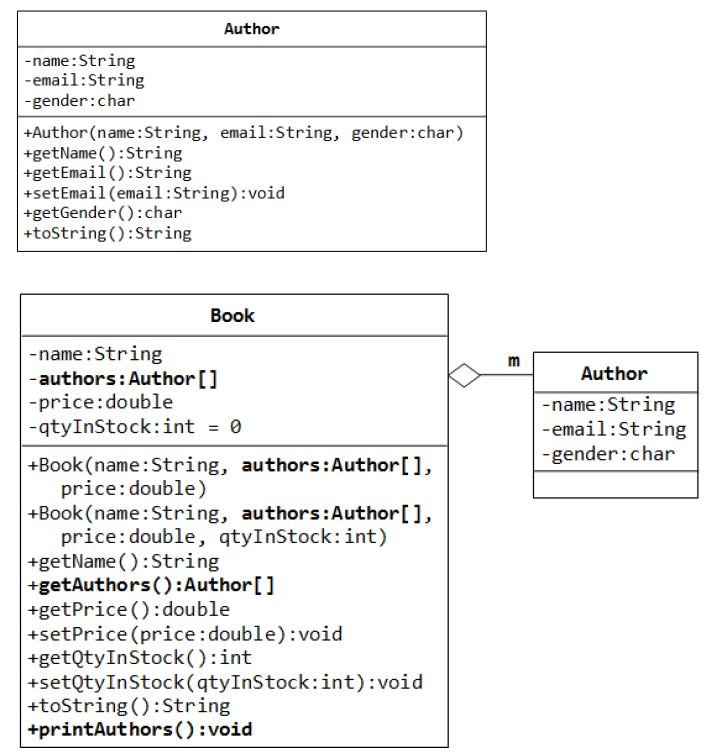
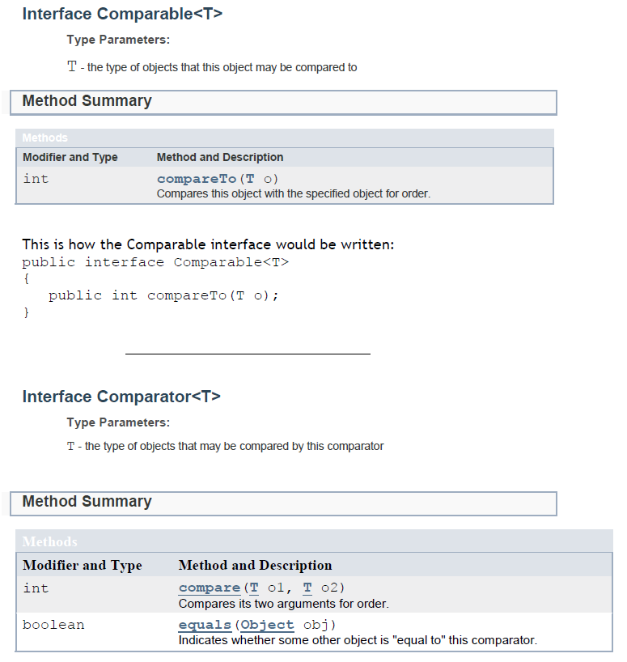

# Examinations

## Contents
- [Past Papers](#past-papers)
- [Revision](#revision)
  - [Week 7 Question 1](#week-7-question-1)
  - [Week 7 Question 2](#week-7-question-2)
  - [Week 8 Question 3](#week-8-question-3)
  - [Week 9 Question 4](#week-9-question-4)
  - [Week 10 Question 5](#week-10-question-5)
  - [Week 11 Question 6](#week-11-question-6)


## Past Papers


- [Object Oriented Programming January 2017](../exams/ObjectOrientedProgrammingJanuary2017.pdf?raw=true)
- [Object Oriented Programming January 2016](../exams/ObjectOrientedProgrammingJanuary2016.pdf?raw=true)
- [Object Oriented Programming Autumn 2016](../exams/ObjectOrientedProgrammingAutumn2016.pdf?raw=true)
- [Object Oriented Programming January 2015](../exams/ObjectOrientedProgrammingJanuary2015.pdf?raw=true)
- [Object Oriented Programming Autumn 2015](../exams/ObjectOrientedProgrammingAutumn2015.pdf?raw=true)
- [Object Oriented Programming January 2014](../exams/ObjectOrientedProgrammingJanuary2014.pdf?raw=true)
- [Object Oriented Programming Autumn 2014](../exams/ObjectOrientedProgrammingAutumn2014.pdf?raw=true)
- [Object Oriented Programming January 2013](../exams/ObjectOrientedProgrammingJanuary2013.pdf?raw=true)
- [Object Oriented Programming Autumn 2013](../exams/ObjectOrientedProgrammingAutumn2013.pdf?raw=true)
- [Object Oriented Programming January 2012](../exams/ObjectOrientedProgrammingJanuary2012.pdf?raw=true)
- [Object Oriented Programming Autumn 2012](../exams/ObjectOrientedProgrammingAutumn2012.pdf?raw=true)


## Revision

Attempt these questions as part of your revision for the January examination.  


### Week 7 Question 1

*From January 2016*

Create a new program project ``Week7Q1`` and provide the code for this question.


Given the ``BankAccount`` class and skeleton code for the ``CheckingAccount`` class in the *Appendix* (see below), answer the following:

1.	*Shadowing of instance fields is a common mistake for programmers who are new to inheritance*. Explain what this means. (4 marks) 

	With the above statement in mind, correct the mistake that is contained in the instance fields declared in the ``CheckingAccount`` class. (2 marks)

2.	Supply the code for the empty methods in the Checking Account class. (6 marks)

3.	Give an illustration of how the ``super`` keyword prevents infinite recursion. (4 marks)

4.	For the tester code given:

	```java
	public class AccountTester 
	{ 
	  public static void main(String[] args) 
	  { 
	    CheckingAccount harrysChecking = new CheckingAccount(125); 
	    harrysChecking.withdraw(70); 
	    harrysChecking.deposit(50); 
	    harrysChecking.deposit(45); 
	    harrysChecking.deposit(16); 
	    harrysChecking.withdraw(50);
	    // Simulate end of month 
	    harrysChecking.deductFees();
	    
	    // Print out how much is in the account
	  }
	}
	```

	-	add code to print the total amount of money in harrysChecking at the end. (2 marks)
	-	calculate the total amount of money in harrysChecking at the end. (2 marks)

5.	Provide a method in the ``BankAccount`` class called ``transfer()`` that will allow for transfer of money from one ``BankAccount`` to another. (5 marks)


**Appendix**

```java
/**
 A bank account has a balance that can be changed by 
 deposits and withdrawals. 
 */

public class BankAccount 
{ 
  // declare instance variables 
  private double balance; 

  /**
   Constructs a bank account with a zero balance 
   */
  public BankAccount() { 
    balance = 0;
  }

  /**
   Constructs a bank account with a given balance 
   @param initialBalance the initial balance 
   */
  public BankAccount(double initialBalance) { 
    balance = initialBalance;
  }

  /**
   Gets the current balance of the bank account. 
   @return the current balance 
   */
  public double getBalance() { 
    return balance;
  }

  /**
   Deposits money into the bank account. 
   @param amount the amount to deposit 
   */
  public void deposit(double amount) { 
    balance = balance + amount;
  }

  /** 
   Withdraws money from the bank account. 
   @param amount the amount to withdraw 
   */
  public void withdraw(double amount) { 
    balance = balance - amount;
  }
}

```

**CheckingAccount.java**

```java
/**
 A checking account that charges transaction fees. 
 */
public class CheckingAccount extends BankAccount 
{
  private int transactionCount;
  private double balance;

  private static final int FREE_TRANSACTIONS = 2; 
  private static final double TRANSACTION_FEE = 1.5; 

  /**
   Constructs a checking account with a given balance. 
   @param initialBalance the initial balance 
   */
  public CheckingAccount(double initialBalance) {
  }

  /**
   Deposit into the account. This is a transaction. 
   @param amount the amount to deposit 
   */
  public void deposit(double amount) {
  }

  /**
   Withdraw from the account. This is a transaction. 
   @param amount the amount to withdraw 
   */
  public void withdraw(double amount) {
  }
  /**
   Deducts the accumulated fees and resets the transaction count. 
   */
  public void deductFees() { 
    if (transactionCount > FREE_TRANSACTIONS) { 
      double fees = TRANSACTION_FEE * (transactionCount - FREE_TRANSACTIONS); 
      super.withdraw(fees);
    }
    transactionCount = 0;
  }
}

```


### Week 7 Question 2

*From January 2016*

The ``Book`` and ``Author`` classes shown below are an example of composition; a book is composed of a number of authors.




1.  Provide the code for each of the ``Book`` class constructors. (6 marks)

2.  Provide the code for the ``printAuthors()`` method. Assume that all other methods are complete. (5 marks)

3.  Show how you would create a ``Book`` object in a tester class. The book should be: "The Best American Short Stories", price: 9.80, quantity: 3. The authors should be: "Heidi Pitior, hpitior@gmail.com, female", "Jennifier Egan, jegan@yahoo.com, female", "Mike Atwell, matwell@hotmail.com, male". (6 marks)

4.  Continuing your tester in part (3), show how you could then search for the author named Jennifer Egan and, if found, change the associated email address to jennifer.egan@gmail.com. Note: Your search must retrieve the author information from the book object. (8 marks)


### Week 8 Question 3

*From January 2014*

The Appendix contains a ``Book`` class, a ``BookStoreTester`` class and sample output for partial title matching.

1.  Provide a ``BookStore`` class. The class should initially contain:

  - An ArrayList<Book> reference called ``books``. (2 marks)

  - An ``addBook()`` method which will accept a book object as a reference. It will add the book to the ArrayList. (3 marks)
  
  - A method called ``listAll()`` which uses an enhanced for loop to iterate over the ArrayList printing each book's details (4 marks)


2.  Add a ``searchByTitle()`` method to the ``BookStore`` class which will provide the following:

  - It should have the signature:

  ```java
  public ArrayList<Book> searchByTitle(String searchStr)
  ```

  - The method should allow partial matches - hint: the ``String`` class has a ``contains()`` method which takes a string argument and returns true/false depending on whether the current string contains the argument string.

  - The method should return all books which match the *searchStr*. If there are no matches it should return an empty list. (10 marks)

3.  Explain briefly (you do not have to provide the actual code) the modifications required to have a "search by genre" facility. (6 marks)


**Appendix**

**Book.java**

```java
public class Book
{
  private String title;
  private String author;
  private double price;
  
  public Book(String title, String author, double price)
  {
    this.title = title;
    this.author = author;
    this.price = price;
  }
  public String getAuthor()
  {
    return author;
  }
  public String getTitle()
  {
    return title;
  }
  public double getPrice()
  {
    return price;
  }
  public String toString()
  {
    return ("title: " + title + "\t"
      + "author: " + author + "\t"
      + "price: " + price + "\n");
  }
}

```

**BookStoreTester.java**

```java
BookStore theBookShop = new BookStore();
theBookShop.addBook(new Book("Big Java", "Horstmann", 38.99));
theBookShop.addBook(new Book("The Corrections", "Franzen", 12.99));
theBookShop.addBook(new Book("Five Go Camping", "Enid Blyton", 7.90));
theBookShop.addBook(new Book("Head First Java", "Kathy Sierra", 42.50));
ArrayList<Book> searchResult;
searchResult = theBookShop.searchByTitle("Java");
println(searchResult);

```


### Week 9 Question 4

*From January 2016, 2015, 2014*

A basic ``Person`` class is given below. Answer the subsequent questions based on this class.  You may find it useful to refer to the Appendix for this question.

```java
public class Person 
{ 
  private String name; 
  private int age;
  
  public Person(String name, int age) 
  { 
    this.name = name; 
    this.age = age;
  }
}

```

1.  Override the ``toString()`` method. (2 marks)

2.  Amend the ``Person`` class so the code snippet below will work properly:

  ```java
  ArrayList<Person> people = new ArrayList<Person>(); 

  //Assume Person objects have been added to the list 

  if (people.contains(new Person("Adam Ant", 48))) 
  { 
    //Do something
  } 
  else 
  { 
    //Do something else
  }

  ```

  (8 marks)

3.  Assuming that I want to use the ``sort()`` method of the ``Collections`` class to sort the ``people`` list alphabetically by name - ``Collections.sort(people);`` - provide the required changes to the ``Person`` class. (6 marks)

4.  If I also wish to provide the additional capability of sorting by age, provide a mechanism that will allow this additional sorting capability. Show how you would invoke the ``Collections.sort()`` method for this. (9 marks)


**Appendix**




### Week 10 Question 5


*From January 2016*

The Appendix consists of ``Sorter`` class with ``selectionSort()`` and ``bubbleSort()`` methods.

1.  The ``bubbleSort()`` algorithm could potentially quit sorting if it realised that there were no swaps on the previous pass. Amend the method to provide this functionality (hint: use a boolean flag) [5 marks]

  Test this works with this code:

  ```java  
  int[] nums = {6, 3, 4, 5, 1, 2};

  void setup()
  {
    size(100, 100);
    
    printNums(nums);
    
    // choose ONE sort method:  
    //Sorter.selectionSort(nums);  
    //Sorter.bubbleSort(nums); 
    
    printNums(nums);
  }

  void draw()
  {
  }

  public void printNums(int[] array)
  {
    print("Array=[");
    for (int i=0; i<array.length; i++)
      print(array[i]+",");      
    println("]");
  }

  ```

2.  For a list with 7 elements in it, determine how many comparisons would be required by the selectionSort algorithm. [3 marks]

3.  The sort methods work on integer arrays. Briefly outline the changes required to the methods so that they would work on an array of objects, such as Strings. [4 marks]  {Test your answer}

4.  What requirement must the class - ``String``, as mentioned above, or indeed a class you might have created yourself such as ``Person`` – fulfil so that your sort methods can work?
[3 marks] {Test your answer}


**Appendix**

```java
public static class Sorter 
{

  public static void selectionSort(int[] array)
  {
    int temp; // temporary location for swap
    int max;  // index of maximum value in subarray

    for (int i=0; i<array.length; i++)
    {
      // find index of largest value in subarray
      max = indexOfLargestElement(array, array.length-i);

      // swap array[max] and array[array.length – i - 1]
      temp=array[max];
      array[max]=array[array.length-i-1];
      array[array.length-i-1]=temp;

    }
  }

  // Finds index of largest element
  public static int indexOfLargestElement(int[] array, int size)
  {
    int index=0;
    for (int i=1; i<size; i++)
    {
      if (array[i]>array[index])
        index=i;
    }
    return index;
  }

  ///////////////////////////////////////////////////////////////////////////////////////////
  
  public static void bubbleSort(int[] array)
  {
    for (int i=0; i<array.length-1; i++)
    {

      for (int j=0; j<array.length-i-1; j++)
      {
        if (array[j]>array[j+1])
        {
          // swap the adjacent elements
          int temp=array[j+1];
          array[j+1]=array[j];
          array[j]=temp;
        }
      }

    }
  }
}


```

### Week 11 Question 6


*From January 2016, January 2015, January 2014, January 2013*

The Appendix contains a ``Searcher`` class with a ``binarySearch()`` method.


1.  For the following array (13 elements), determine the indices that binarySearch will look at when searching for the search-key 10.

  [2, 5, 7, 13, 15, 16, 18, 20, 22, 24, 30, 34, 39]

  Your answer should identify what occurs on each pass in terms of the variables ``mid``, ``start``, ``end``. [7 marks)

2.  How many passes are required in a ``binarySearch()`` for an array/list containing 40 elements? You should explain your answer. [3 marks]

**Appendix**

```java
public static class Searcher
{

  public static int binarySearch(int[] list, int key) 
  { 
    int mid=0; 
    int start=0; 
    int end=list.length-1; 
    boolean found=false; 

    //Loop until found or end of list. 
    while (start <= end && !found) 
    { 
      mid = (start + end) / 2; 
      if (list[mid] == key)
        found = true;
      else 
        if (list[mid] > key) 
          end = mid - 1;
        else 
          start = mid + 1;
    }

    if (found) 
      return mid;
    else 
      return(-1);
  }
}

```