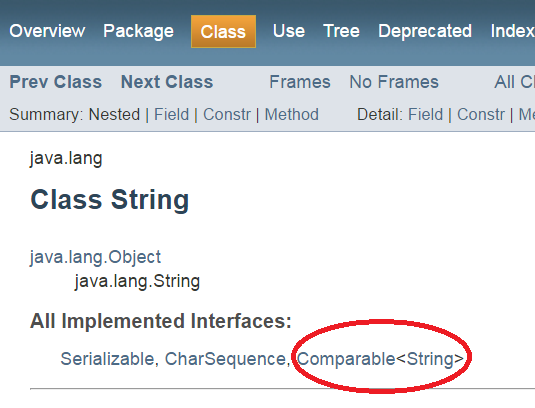
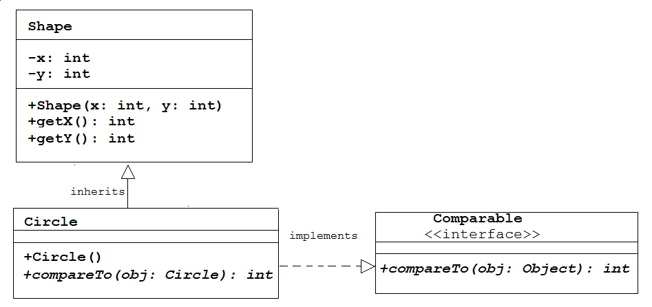
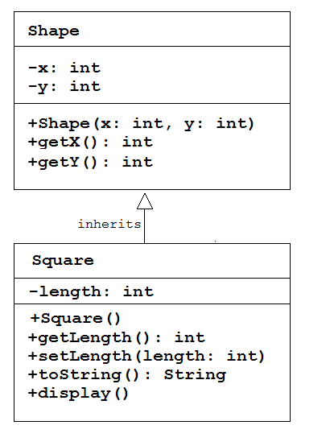
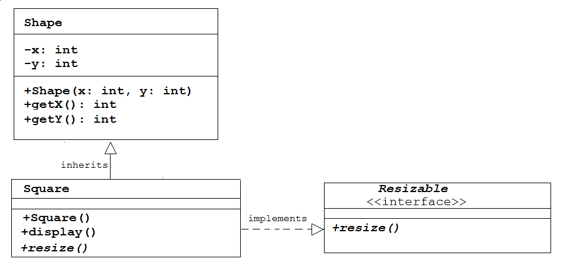
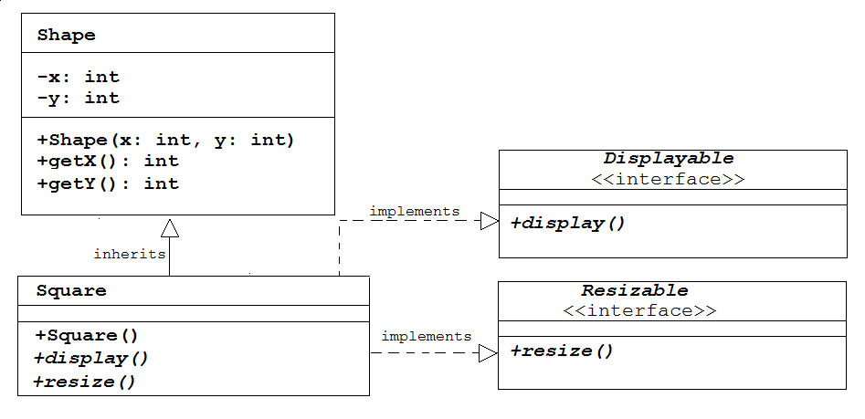

# Interfaces

## Contents

- [``String`` class and ``Comparable`` interface](#string-class-and-comparable-interface)
- [``Circle`` class and ``Comparable`` interface](#circle-class-and-comparable-interface)
- [``Comparator`` interface](#comparator-interface)
- [``Shape`` class and ``Comparator`` interface](#shape-class-and-comparator-interface)
- [``Comparable`` versus ``Comparator``](#comparable-versus-comparator)
- [User-Defined Interfaces](#user-defined-interfaces)
- [Interfaces and Abstract Classes](#interfaces-and-abstract-classes)

Interfaces are another important concept in Java.  They allow a class to behave like some other class.  We've already seen that with inheritance, but you can only inherit from one class in Java.  Interfaces allow a class to have the same kind of behaviour as class X, class Y and class Z.  Think of it as providing the functionality of multiple class inheritance.

Interfaces are everywhere in Java. You can write your own interfaces or you can implement one (or more) of Java's built-in interfaces.

The best way to introduce the concept is to implement one of the Java's most commonly used interfaces - the ``Comparable`` interface ([see API](https://docs.oracle.com/javase/7/docs/api/java/lang/Comparable.html)).  It allows the ordering of objects into their natural order.  For example, strings could be ordered alphabetically, bank accounts by balance, etc.

The code for the ``Comparable`` interface looks something like this:

```java
public interface Comparable<T>
{
	public int compareTo(T obj);
}

```

-	the ``interface`` keyword indicates that this code is an interface and ``Comparable`` is the name of this interface.  
-	this interface has just one method - ``compareTo()``.  It receives an object argument and returns an ``int``.   It's a public abstract method because the code for it is not implemented in the interface.  In fact all interface methods are abstract.
-	the ``T`` part is a generic way of referring to the type of the object, e.g. a ``String``, ``Person``, etc.  Don't worry about these specifics.

An interface looks a bit like a class but it doesn't have any behaviour.  In fact, **all interfaces are a description of promised behaviour**.  Interfaces are a way of saying "you need to plug some code in here for this thing to fully work".

As programmers we have to say when a class fulfills the promise of an interface.  When a class fulfills the behaviour of a interface it uses the keyword ``implements``.  For example, the code for the ``String`` class may look something like this:

```java
public class String implements Comparable
{
	...

	public int int compareTo(String obj)
	{
		if(this.value < obj.value)
			return -1;                // negative integer
		if(this.value > obj.value)
			return 1;                 // positive integer
		return 0;
	}
}

```

Above ``compareTo()`` returns a negative integer, zero, or a positive integer if this object is less than, equal to, or greater than the specified object.

It means that the ``String`` class implements (writes) the code for the ``compareTo()`` method.  In fact ``String`` really does implement ``Comparable``.  See this snapshot from the Java documentation for ``String``:



See the full documentation [here](https://docs.oracle.com/javase/7/docs/api/java/lang/String.html).  As mentioned earlier, Java uses interfaces everywhere.


## ``String`` class and ``Comparable`` interface

The String is one of many classes that implements the ``Comparable`` interface.  In fact, ``String`` implements a number of interfaces.  This is a powerful concept: we can implement as many interfaces as we like. Compare this to inheritance: we can only inherit from one superclass.

Because the ``String`` class implements the interface we now know that it provides an implementation of the ``compareTo()`` method. Let’s use it:

```java
String s1 = "bob";
String s2 = "alice";

int compareResult = s1.compareTo(s2);

if (compareResult == 0)
  println("Strings are equal");
else if (compareResult > 0)
  println("s1 is greater than s2");
else if (compareResult < 0)
  println("s1 is less than s2");

```

If we run this code it will print the second option (because 'b' is "greater than" 'a') .

Here's a more powerful example:

```java
ArrayList<String> list = new ArrayList<String>();
list.add(new String("bob"));
list.add(new String("alice"));
list.add(new String("mary"));
list.add(new String("john"));

//Print list
println("List: " + list);

java.util.Collections.sort(list);

//Print list
println("List: " + list);

```

This code prints:

```
List: [bob, alice, mary, john]
List: [alice, bob, john, mary]

```

There is a convenient static method ``sort()`` in the ``Collections`` class we can use to sort our ArrayLists.  In fact, the ``sort()`` method **depends upon** our objects implementing the ``Comparable`` interface.  ``sort()`` compares adjacent objects and sees if it needs to reorder them.  

This is the essence of interfaces - the ``String`` class implements the interface and other classes/methods can then safely "plug into" the interface.


## ``Circle`` class and ``Comparable`` interface

Let's look at how to do it in the context of the ``Circle`` class:



We've seen already that ``Circle`` inherits from ``Shape``, but here we also want ``Circle`` to implement the behaviour of ``Comparable`` too.  Why?  Because we may want to be able to compare a number of different circles by their radiuses.

So here is the code for ``Circle`` that ``implements`` the ``Comparable`` interface:

```java
public class Circle extends Shape implements Comparable<Circle>
{
  private int radius;

  public Circle(int x, int y, int radius) 
  {
    super(x, y);
    this.radius = radius;
  }

  public void display()
  {
    ellipse(getX(), getY(), radius*2, radius*2);
  }
  
  public int compareTo(Circle otherCircle)
  {    
    if (this.radius<otherCircle.radius)
      return -1;
    if (this.radius>otherCircle.radius) 
      return 1;
    return 0;s
  }
}

```

If we run this code:

```java
ArrayList<Circle> circles = new ArrayList<Circle>();
circles.add(new Circle(100,100,75));
circles.add(new Circle(300,100,50));
circles.add(new Circle(500,100,25));

println("Before sort():"+circles);  
java.util.Collections.sort(circles);
println("After sort():"+circles);    

```

it prints:

```
Before sort():[Circle[radius=75], Circle[radius=50], Circle[radius=25]]
After sort():[Circle[radius=25], Circle[radius=50], Circle[radius=75]]

```

Again, the ``sort()`` method depends you implementing the ``Comparable`` interface so that it can compare one circle to another.  With your ``compareTo()`` method you have decided how to compare circles and ultimately sort them by ascending radius values.


## ``Comparator`` interface

In the previous example we sorted circles in ascending order using radius values.  But, we only **compare** circles by radius.  The ``compareTo()`` method only considers radius values.  Wouldn't it be nice if we could sort circles on their ``x`` coordinate value, or ``y`` value, or any other class variable.  Well, we can using an interface called ``Comparator``.

By default the ``Collections.sort()`` method uses an object's ``Comparable`` interface but we can invoke an overloaded version of ``sort()`` to use a ``Comparator`` object.

The code for the ``Comparator`` interface looks something like this:

```java
public interface Comparator<T>
{  
  public int compare(T obj1, T obj2);
  public boolean equals(Object obj);
}

```

The interface has two methods:

- ``compare()`` - receives two object arguments and returns a negative integer, zero, or a positive integer if the first argument is less than, equal to, or greater than the second.
- ``equals()`` - used for comparing comparator objects.  We'll not implement, but the one we inherit from ``Object`` will suffice.


## ``Shape`` class and ``Comparator`` interface

We can use the ``Comparator`` interface to allow us to sort by multiple class variable values.  Therefore, we could sort circles by radius, x, y values.  Let's write the code to sort circles by ``x`` and ``y`` values.

Here is the comparator class for comparing ``x`` values:

```java
public class XComparator implements java.util.Comparator<Shape>
{
  public int compare(Shape ob1, Shape ob2)
  {
    return ob1.getX() - ob2.getX();
  }
}

```

Remember, the ``x`` and ``y`` values are declared in the ``Shape`` class, so we use it in the code above.  Through inheritance we can still compare ``x`` values of any subclass of ``Shape`` including circles.

Above, we return a negative integer, zero, or a positive integer if the x value of ``obj1`` is less than, equal to, or greater than the x value of ``obj2``.

Note: we should also provide the ``equals()`` method, but the one we inherit from the ``Object`` class will allow this to compile.

And here's the code for comparator for the ``y`` value:

```java
public class YComparator implements java.util.Comparator<Shape>
{
  public int compare(Shape ob1, Shape ob2)
  {
    return ob1.getY() - ob2.getY();
  }
}

```

We can now sort by either x or y value.  If we run this code:

```java
ArrayList<Circle> circles = new ArrayList<Circle>();
circles.add(new Circle(100, 300, 50));
circles.add(new Circle(200, 200, 50));
circles.add(new Circle(300, 100, 50));

java.util.Collections.sort(circles, new XComparator());
println("Sorted by X:"+circles);
java.util.Collections.sort(circles, new YComparator());
println("Sorted by Y:"+circles);

```

it prints:

```
Sorted by X:[Circle[x=100,y=300,radius=50], Circle[x=200,y=200,radius=50], Circle[x=300,y=100,radius=50]]
Sorted by Y:[Circle[x=300,y=100,radius=50], Circle[x=200,y=200,radius=50], Circle[x=100,y=300,radius=50]]

```

Now we have the ability to sort objects using different class variables.


## ``Comparable`` versus ``Comparator``

When your class implements ``Comparable`` the ``compareTo()`` method of the class is defining the "natural" ordering of that object. 

A ``Comparator`` is its own definition of how to compare two objects, and can be used to compare objects in a way that might not align with the natural ordering.

For example, Strings are generally compared alphabetically. Thus the "a".compareTo("b") would use alphabetical comparisons - their "natural ordering". If you wanted to compare Strings on length, you would need to write a custom comparator.

In general implement ``Comparable`` for natural order and write a ``Comparator`` for other sorting or comparison needs.

*Source: [StackOverflow.com](http://stackoverflow.com/questions/4108604/java-comparable-vs-comparator)*


## User-Defined Interfaces 

### Background

Above, we introduced interfaces by examining some Java defined interfaces -- ``Comparable`` and ``Comparator``.

Here we'll look at defining our own interfaces.

When you create an interface, you're defining a contract for *what* a classes can do, without saying anything about *how* the class will do it.  The word *do* is important here.

In summary:

- use interfaces to define **what an object can do** but don't specify how to do it
- use classes to specify **what an object is** and how to implement interfaces

For example, in the context of the shape ``Square`` let's think about *what it can do* and *what it is*.  




**What can ``Square`` do?**

When we say *do* we mean action words like display, move, resize, bounce, etc.  Not get the area, set the x value, etc.

So our square class has only one action method - ``display()``.


**What the ``Square`` is?**

Here, we mean its state or the contents of its variables.  The ``Square`` has variables like length, x, y and getter and setter methods for those variables.

### User-Defined Interface ``Resizable``

Let's look at a practical example of a useful user-defined interface.  Let's say we want to be able to resize any of our shape objects.  We can create an interface ``Resizable`` that defines **what** our shapes can do:

```java
public interface Resizable
{
  public void resize(double percentage);
}

```

We could then have the class ``Square`` implement how to do it:

```java
public class Square extends Shape implements Resizable
{
  ...

  public void resize(double percentage)
  {
    length+=(int)(length*percentage);
  }
}

```

This diagram illustrates what we've done:



> **Interface Naming Convention** -  use an adjective (typically ending with "able") consisting of one or more words. For example - Comparable, Resizable, Displayable, Bounceable, etc.

We could now revisit how the ``display()`` method was initially implemented.  We could have an interface ``Displayable`` too:

```java
public interface Displayable
{
  public void display();
}

```

We could then have the class ``Square`` implement how to do it:

```java
public class Square extends Shape implements Resizable, Displayable
{
  ...

  public void resize(double percentage)
  {
    length+=(int)(length*percentage);
  }

  public void display()
  {
    rect(getX(), getY(), length, length);
  }
}

```

Now, we've implemented this:



We're now saying a square is a shape and it is displayable and resizable.  This is a powerful concept provided in Java.


### Multiple Interfaces 

Java supports only single inheritance.  That is, a subclass can be derived from one and only one superclass.  Java does not support multiple inheritance.

A subclass, however, can implement more than one interface.  In other words, Java indirectly supports multiple inheritance via implementing multiple interfaces. For example:

```java
public class Square extends Shape implements Resizable, Displayable
{
  ...
}

```

extends one superclass but implements multiple interfaces.


## Interfaces and Abstract Classes

The concepts of abstract classes and interfaces are quite similar.  Whether you use abstract classes or interfaces is frequently just a matter of choice by the designer.

Here are some differences:

Abstract Class | Interface
---------------|------------
An abstract  class  can  have  both  abstract and concrete methods | An interface can have only abstract methods
A class can extend only one abstract class | A class can implement any number of interfaces
In an abstract class the keyword ``abstract`` is mandatory in the signature of an abstract method | In an interface the keyword ``abstract`` is optional in method signatures
Abstract class variables and methods can be ``public``, ``private`` or ``protected`` | Interface variables and methods are ``public`` by default.
A (abstract) class does not support multiple inheritance | Interfaces support multiple inheritance


