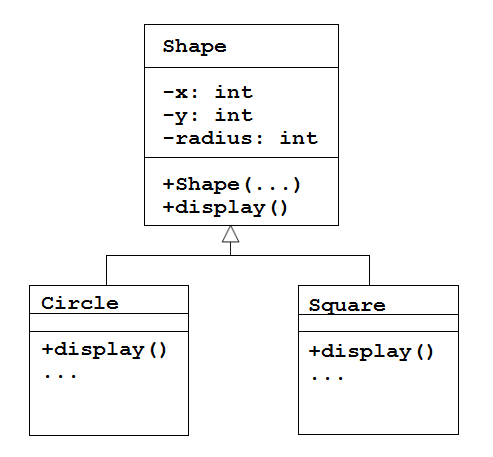
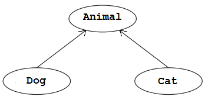

# Polymorphism

## Contents

- [Polymorphism](#polymorphism)
- [Method Overloading](#method-overloading)
- [Method Overloading versus Method Overriding](#method-overloading-versus-method-overriding)
- [instanceof operator](#instanceof-operator)
- [Casting](#casting)

## Polymorphism

Polymorphism is a complicated name for something straightforward.

Polymorphism can be provided in inheritance through method overriding combined with the use of superclass references.
It occurs when a subclass has a method with the same signature as a method in the superclass.
When this happens, the method in the subclass overrides the method in the superclass.  An example will make this clear.

Let's revisit the ``Shape``, ``Circle`` and ``Square`` classes seen earlier.



We override the ``display()`` method in ``Circle`` and ``Square`` to perform the specialist drawing for those shapes.

Let's create an number of shape objects and display them:

```java
ArrayList<Shape> shapes;

void setup()
{
	size(600,600);
	shapes = new ArrayList<Shape>();

	// add 3 circles
	shapes.add(new Circle(100,100,10));
	shapes.add(new Circle(200,100,10));
	shapes.add(new Circle(300,100,10));

	// add 3 squares
	shapes.add(new Square(100,200,20));
	shapes.add(new Square(100,300,20));
}

void draw()
{
	for(Shape shape: shapes)
	{
		shape.display();
	}
}

```

``Circle`` and ``Square`` objects are added to the shapes arraylist of ``Shape`` objects.  This is legal and fine because a circle is-a shape and a square is-a shape.  A superclass reference can point to a subclass object.


Here's the polymorphism.  The line of code:

```java
shape.display()

```

invokes different versions of the ``display()`` method at run-time based on what the object ``shape`` actually is.  That’s polymorphism.

The same line of code **invokes different behaviour at run-time** (not compile-time). That’s what polymorphism is.


## Method Overloading

In any class you can use the same *name* for several different but related methods.  You still need to distinguish them from each other by using signatures with different arguments and optionally a different return type.  The rules are simple:
- overloaded methods *must* change the argument list
- overloaded methods *can* change the return type


Here are two overloaded methods:

```java
public class SomeClass
{
	public int addValues(int x, int y)
	{
		return x+y;
	}

	public int addValues(int x, int y, int z)
	{
		return x+y+z;
	}
}

```

The first ``addValues()`` method takes two arguments.  The second ``addValues()`` method takes three arguments.  


Another example of overloaded methods come from the ``Integer`` class:

```java
public static int parseInt(String s) throws NumberFormatException;
public static int parseInt(String s, int radix) throws NumberFormatException;

```

The first method gets a string representation of an integer and returns an ``int``.  The second gets a string and a base value.  Here's a quick example of them being used:

```java
int x = Integer.parseInt("10");      
int y = Integer.parseInt("101",2);   // 101 is a binary value; 2 is base for binary numbers

println(x);  // prints int value 10
println(y);  // prints int value 5

```

**Wrapper Classes**

The ``Integer`` class is a *wrapper class* for the ``int`` primitive data type.

A wrapper class is a class wrapped around a primitive data type so you can treat that primitive type as an object.  Examples are ``Integer``, ``Double``, ``Float``, etc.


## Method Overloading versus Method Overriding

*Overloading* allows several methods to have the same one name, and the compiler will choose the one you want to use by matching argument types in the signature.


*Overriding* occurs when one class extends another, and the subclass has a method with the same signature as a method in the superclass.


## instanceof operator

The ``instanceof`` operator is used with superclasses to tell if you have a particular subclass object.  For example, we may have the following code for the classes ``Shape``, ``Circle`` and ``Square`` seen earlier:

```java
Shape aShape;

aShape = new Circle(100,100,10);

if(aShape instanceof Circle)
	println("a circle");
else if(aShape instanceof Square)
	println("a square");

```

Here ``aShape`` is a reference to a ``Circle`` object.  The ``if()`` statement determines if ``aShape`` is an instance of the ``Circle`` or ``Square`` class an prints a message.  In this case "a circle" is printed.


## Casting

Let's look at the compatibility between subclasses and superclasses a bit more.  We'll use the class hierarchy:



and this code:

```java
Animal animal;
Dog fido = new Dog();
Cat kitty = new Cat();

```
You can always make a more general object hold a more specialised one like this:

```java
animal = fido;

```

but the opposite is not true without an explicit type conversion or *casting*.  Above, we assign ``fido`` (a ``Dog`` object) into ``animal`` (an ``Animal`` object).

All dogs are animals but not all animals are dogs.  Cats are animals too.  Therefore you cannot directly do this:

```java
fido = animal;

```

because we cannot assume the ``animal`` object is a reference to a ``Dog`` object.  It can/could be a reference to ``Cat`` object.  The assignment above will cause a compilation error.  However, you can cast it.  To cast any type, write the typename in parentheses before the object being cast.  Therefore:

```java
fido = (Dog)animal;

```

allows the compilation to work and the conversion is checked at runtime.  Above, we assign ``animal`` into ``fido`` and we are explicitly stating that ``animal`` is a reference to a ``Dog`` object.

In summary:
-	You can always assign:
	```java
	parent = child
	``` 
	A cast is not needed.

-	You can assign:
	```java
	child = (child)parent
	``` 
	A check is made at runtime.  If the parent refers to the correct child type, assignment will happen.  If not an exception will occur.


Finally, you can use the ``instanceof`` operator at runtime to check the type of an object before you cast it.  For example:

```java
if(fido instanceof Dog)
	fido = (Dog)animal;

```


