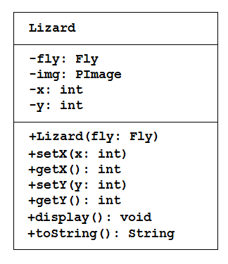
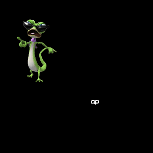
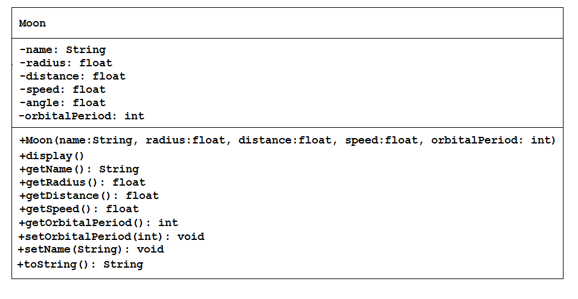
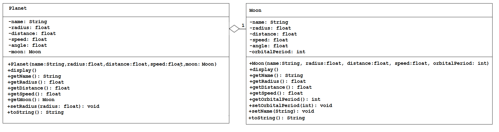
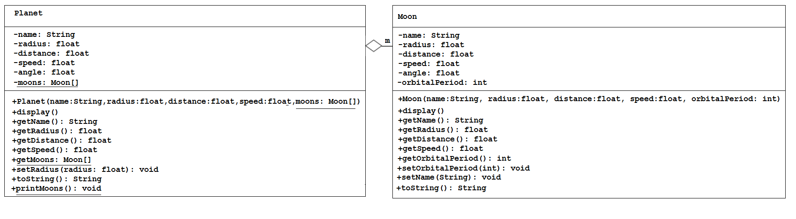

# Tutorial #4 - Composition

## Part 1 - Book "has-a" Author

1.	Run the program [tut04_01](../code/tutorials/tut04_01/tut04_01.zip?raw=true) and observe it's output.
	
	Make sure you include the ``images`` folder in your project folder.

	Pay particular attention to the ``Book`` class and how it implements the "has-a" relationship with the ``Author`` class.

	> A Book has-a Author

	This is known as **composition** in Java.

2.	Open the program [tut04_02](../code/tutorials/tut04_02/tut04_02.zip?raw=true).

3.	Examine the code in the ``setup()`` method.  Then modify the code in the ``Book`` class so that it supports an array of ``Author`` objects.  You only need to modify the code in ``Book`` class.

	When the ``Book`` class is modified correctly the code should show a book with 2 authors.
	

## Part 2 - Zack the Lizard

Zack is a lizard.  Flies annoy him.

This program illustrate composition again:

> A ``Lizard`` has-a ``Fly``

Read on...

Open the program [tut04_03](../code/tutorials/tut04_03/tut04_03.zip?raw=true) and write the missing code for the ``Lizard`` class. 



The ``Lizard`` class has:

-	four private instance variables: ``fly``, ``img``, ``x``, and ``y``.  ``fly`` is an instance of the ``Fly`` class which you are given.

-	a constructor:

	```java
		public Lizard(Fly fly) {...}

	```

	Initialise the class variable ``fly`` with the constructor argument ``fly``.  Also, initialise the ``x`` and ``y`` values to ``0`` (zero).

-	public methods ``setX()``, ``getX()``, ``setY()``, ``getY()``, and ``display()`` which you are given.

-	``toString()`` which should return "[Lizard: x=*x*;y=*y*]" e.g. "[Lizard: x=100;y=200]"


1.	Complete the missing code in ``Lizard`` class.  If completed correctly the project should run.  A fly should annoy the lizard.

	


2.	Next, modify the code in the ``Lizard`` class so that it supports an array of 10 ``Fly`` objects.  You will not need to modify any code in the ``Fly`` class.

	Use this new ``display()`` method in the ``Lizard`` class:

	```java
	public void display()
	{
		img = loadImage(imageFile);
		setX(mouseX);
		setY(mouseY);
		image(img, getX(), getY());    

		for (int i=0; i<flies.length; i++) // flies array
		{
			flies[i].move();
			flies[i].display();
		}
	}

	```

	and use this code to test your modified ``Lizard`` class:

	```java
	Lizard lizard;
	Fly[] flies;

	void setup()
	{
		size(800, 800);
		noCursor();

		flies = new Fly[10];
		for(int i=0;i<flies.length;i++)
			flies[i]=new Fly();

		lizard = new Lizard(flies);
	}

	void draw()
	{
		background(0);  
		lizard.display();
		println(lizard);  
	}

	```


## Part 3 - Moons and Planets


Get the program folders [here](../code/tutorials/AllParts.zip?raw=true).

### Moon and Planet Classes




A class called ``Moon`` is designed as shown in the class diagram.  It contains:

-	six private instance variables: ``name``, ``radius``, ``distance``, ``speed``, ``angle`` and ``orbitalPeriod``

-	one constructor to initialise the name, radius, distance, speed, and orbital period with the given values:

	```java
	public Moon(String name, float radius, float distance, float speed, int orbitalPeriod)

	```

	There is no default constructor for ``Moon``, as there are no defaults.

-	public getters/setters: ``getName()``, ``getRadius()``, ``getDistance()``, ``getSpeed()``, ``getOrbitalPeriod()``, ``setName()``, and ``setOrbitalPeriod()``. There are no setters for radius, distance, speed, and angle as these attributes cannot be changed.

-	A ``toString()`` method that returns "Moon: *moon-name* (orbit=*orbitPeriod*);", e.g., "Moon: earth moon(orbit=28);".

Open the test program ``TestMoon`` from the ``part1`` folder and write the code for the ``Moon`` class. Use the test program to test the constructor and public methods. Among other things, try changing the name of a moon, e.g.:

```java
moon = new Moon("Moon", 20, 100, 2, 28);
println(moon); // calls toString()
moon.setName("Earth Moon");
println(moon);

```

If your code is completed correctly, you should see a moon orbit the middle of the window.



A class called ``Planet`` is designed as shown in the class diagram. 
It contains:

-	six private instance variables: ``name``, ``radius``, ``distance``, ``speed``, ``angle`` and ``moon``.  ``moon`` is an object of the class ``Moon`` you have already created.  Assume each planet has one moon.

-	a constructor:

	```java
	public Planet(String name, float radius, float distance, float speed, Moon moon) {...}

	```

-	public methods - ``getName()``, ``getRadius()``, ``getDistance()``, ``getSpeed()``, ``getMoon()``, setRadius()``. There are no setters for name, distance, speed, angle, and moon as these attributes cannot be changed.

-	``toString()`` returns "Planet: *planet name* (r=*radius*;d=*distance*); Moon: *moon-name* (orbit=*orbitPeriod*);" e.g. "Planet: earth (r=25;d=200); Moon: Moon (orbit=28);"

Open the test program ``TestPlanet`` from the ``part1`` folder.  Add the code for your ``Moon`` class from earlier.  And write the code for the ``Planet`` class which uses the ``Moon`` class. Use the test program to test the constructor and public methods. 

Take note that you have to construct an instance of ``Moon`` before you can construct an instance of Planet. e.g.,

```java
Moon moon = new Moon("moon", 7.5, 50, 2, 28);
Planet earth = new Planet("earth", 25, 200, 1, moon);

// OR using an anonymouse Moon object

Planet earth = new Planet("earth", 25, 200, 1, new Moon("moon", 7.5, 50, 2, 28));

```

Note that both classes have similar class variables called name, radius, distance, speed and angle. However, they can be differentiated via the referencing instance. 

If your code is completed correctly, you should see a planet with a moon orbit the sun in the middle of the window.

Try:

1.	Printing the name and orbitalPeriod of the moon from a Planet instance.
(Hint: ``aPlanet.getMoon().getName()``, ``aPlanet.getMoon().getOrbitalPeriod()``).

2.	Introduce new methods (and test, of course) called ``getMoonName()`` and ``getMoonRadius()`` in the ``Planet`` class to return the name and radius of the moon of the Planet. For example,

	```java
	public String getMoonName() { ... }
	public float getMoonRadius() { ... }

	```


### Moon and Planet - Array of Objects

Open the test program ``TestPlanetMoons`` from the ``part2`` folder.

Add your solutions for the ``Planet`` and  ``Moon`` classes written earlier.



In the previous part the assumption was that a planet has one and only one moon. 
In reality, a planet can have none, one or more moons. 
Modify the ``Planet`` class to support more than one moon by changing the instance variable ``moon`` to a ``moons`` array:

```java
-moons: Moons[]

```


Notes:
-	the constructor takes an array of ``Moon`` (i.e. ``Moon[]``), instead of a ``Moon`` instance.

-	the ``toString()`` method shall return "Planet: *planet name* (r=*radius*;d=*distance*) has *n* moon(s);".  Where *n* is the number of moons.  e.g. e.g. "Planet: earth (r=100;d=100) has 1 moon(s);"

-	a new method ``printMoons()`` to print the names of all the moons.

Open the test program ``TestPlanetMoons``.

You are required to:
1.	Modify the ``Planet`` class code for the array of moons.

2.	Modify the ``getMoons()`` method to return the ``moons`` array

3.	Modify ``getMoonName()`` and ``getMoonRadius()`` so they are given an array index value of the moon whose name or radius is required.

4.	Make sure that you test the ``getMoons()`` method.

5.	The method ``printMoons()`` should print not return the planet's moons.

6.	Use this updated code for the ``Planet`` method ``display()``:

	```java
	public void display()
	{
		angle=angle+(0.01*speed);
		pushMatrix();
		rotate(angle);
		translate(distance,0);
		fill(255, 255, 255);
		ellipse(0, 0, radius*2, radius*2);    

		for(Moon moon: getMoons())
			moon.display();

		popMatrix();    
	}

	```

Test your methods. Hints:

```java
// Declare and allocate an array of Moons
Moon[] moons = new Moon[2];
moons[0] = new Moon("Phobos", 5, 50, 2, 28);
moons[1] = new Moon("Deimos", 2.5, -35, 1.5, 42);

// Declare and allocate a Planet instance
mars = new Planet("Mars", 20, 300, 1.5, moons);

print("First moon of mars is:");
println(mars.getMoonName(0));

println(mars); // toString()

print("The moons are: ");
mars.printMoons();  

```

Should print:

```
First moon of mars is:Phobos
Planet: Mars (r=20.0;d=300.0) has 2 moon(s);
The moons are: Moon: Phobos(orbit=28); Moon: Deimos(orbit=42);

```

If your code is completed correctly, you should see a planet with two moons orbit the sun in the middle of the window.


### Moon and Planet - Arraylist of Objects

Open the test program ``TestPlanetMoonsArrayList`` from the ``part3`` folder.

Add your solutions for the ``Planet`` and  ``Moon`` classes written earlier.

You will modify ``Planet`` to have an arraylist of moons replacing the array solution done earlier.  Also a new method called ``addMoon()`` will be added.

To do:

-	Add your solutions to the ``Planet`` and ``Moon`` classes to the project
-	Update ``Planet`` to use an arraylist not an array:

	```java
	//private Moon[] moons;
  	private ArrayList<Moon> moons;
  	```

-	Add a new method that allows you to add a moon object to the arraylist:

	```java
	public void addMoon(Moon moon)
	{
		moons.add(moon);
	}

  	```

-	Make the appropriate changes to other methods to use the arraylist


If your code is completed correctly, you should see a planet with two moons orbit the sun in the middle of the window.


