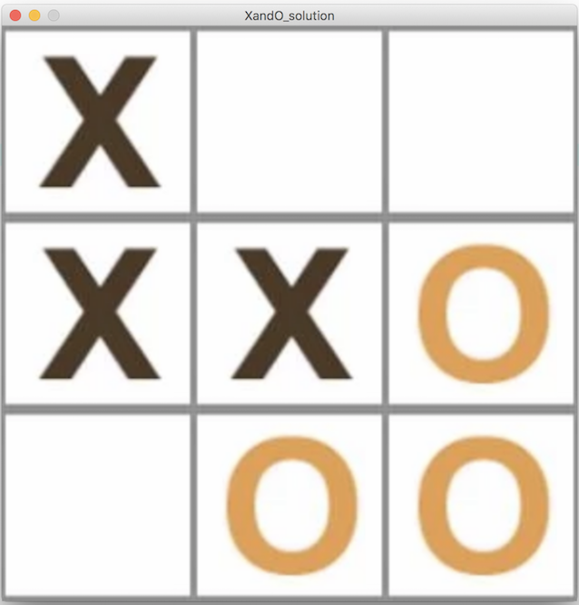

# Tutorial #5 - Inheritance


## Part 1 - Revision


A class called ``Circle`` is designed as shown above. It contains: 

-	three ``private`` instance variables - ``x``, ``y``, and ``radius``
-	one default constructor
-	three public methods: ``display()``, ``getRadius()`` and ``getArea()``


1.	Open and run the program [tut05_01](../code/tutorials/tut05_01/tut05_01.zip?raw=true).  Make sure you understand how this is working.

2.	Modify the class ``Circle`` to include a second constructor for constructing a ``Circle`` instance with arguments for ``x``, ``y`` and ``radius``:

	```java
	public Circle(int x, int y, int radius) 

	```

	Provide the necessary code to initialise the class variables with the constructor arguments.

3.	Modify the test program ``tut05_01`` to construct an instance of ``Circle`` using the new constructor.


4.	Add **getter** methods for both class variables ``x`` and ``y``, for example:

	```java
	public int getX() {...}

	```

5.	Accessing private class variables.  SKIP FOR NOW.


6.	Add three public **setter** methods for changing the ``x``, ``y``, and ``radius`` class variables in ``Circle``.
	
	In ``tut05_01`` test these methods with code like this:

	```java
	c = new Circle();
	c.setX(100);
	c.setY(100);
	c.setRadius(30);

	```


7.	In the second constructor:

	```java
	public Circle(int x, int y, int radius) 

	```

	use the keyword ``this`` when referring to the class variables. (if you're not doing so already)


8.	Every well-designed Java class should contain a method called ``toString()`` that returns a short ``String`` description of the object.  Include a ``toString()`` method in the ``Circle`` class:

	```java
	public String toString()
	{
		return ....;
	}

	```	

	It should return a string in the format:  "Circle: x=<xValue>; y=<yValue>; radius=<radiusValue>;".  For example, "Circle: x=0; y=0; radius=20;"


	In ``tut05_01`` test ``toString()`` works like this:

	```java
	Circle c = new Circle(100,100,50);
	println(c.toString());             // explicit call
	println(c);                        // implicit call

	```


## Part 2 - Inheritance Example


In this exercise a ``Cat`` and ``Dog`` class are implemented as subclasses of an ``Animal`` class as shown above.

1.	Open and run the program [tut05_02](../code/tutorials/tut05_02/tut05_02.zip?raw=true).  

2.	Examine the output in the console windown and take time to trace each method called for the ``cat`` and ``dog`` objects.  Make sure you understand this code.

A subclass can be expanded to include additional functions and properties beyond what is contained in the superclass. For example, let’s assume that a ``Dog`` object has a hair color.

3.	Modify the ``Dog`` class to include a ``String`` variable ``hairColour``.  Assign a default hair colour of "black" in the default constructor.

4.	Also, write setter and getter methods for the ``hairColour`` variable.

5.	Modify the ``toString()`` method to print the dog object's hair colour.  Use the getter method.  Test the ``toString()`` method works correctly.


## Part 3 - Inheritance Shapes

In this part a ``Circle`` and ``Square`` class are implemented as subclasses of a ``Shape`` class.

1.	Open and run the program [tut05_03](../code/tutorials/tut05_03/tut05_03.zip?raw=true).  Examine and understand the code.

2.	Let's have the ``Circle`` class inherit variables and methods from the ``Shape`` class.  Update the ``Circle`` class code so it extends from ``Shape``:

	```java
	public class Circle extends Shape

	```

	Initially, you'll have an error with the ``Circle`` constructor, we'll fix that next.

3.	Every constructor in a subclass should explicitly call a constructor in the superclass.
	Modify the code in the ``Circle`` constructor to do this.  It should look like this:

	```java
	public Circle(int x, int y, int radius)
	{
		super(x, y, radius);

		//this.x=x;
		//this.y=y;
		//this.radius=radius;
	}

	```

	We've done two things here:

	-	we now call our superclass constructor and pass it the values for ``x``, ``y``, and ``radius``.
	-	we no longer need to intialise the ``Circle`` variables ``x``, ``y``, and ``radius``. Indeed we don't need these variables in ``Circle`` at all, because we inherit them from ``Shape``.  This is known as *shadowing of instance fields*.  It should NEVER be allowed to happen. We will fix this next.

4.	Examine the class ``Circle`` and remove any shadow class variables.
	Again, you'll have some errors but we'll fix those next.

5.	Examine the class ``Circle`` and remove any shadow class methods too, i.e. any duplicate methods that are inherited from ``Shape`` already.  You should only remove three methods from ``Circle``.
	You'll have one error with with the ``radius`` variable, we'll fix that next.


6.	The variable ``radius`` is not visible in the ``Cirlcle`` method ``getArea()``.  That is because it is correctly declared as a ``private`` variable in ``Shape``.  To fix this use the publicly visible method ``getRadius()`` from ``Shape``, like this:

	```java
	public double getArea()  
	{
		return getRadius()*getRadius()*Math.PI;
	}

	```
 
7.	Run the sketch.  It should now work.  You will have successfully modified ``Circle`` to inherit from ``Shape``.  Double-check your two classes implement the following class diagram:

 	

8.	Modify the code in ``tut05_03`` to use a ``println()`` statement to print the area of the circle and print a string repesentation of the circle.


9.	Implement a new class called ``Square`` as shown in the class diagram.

	

	It inherits variables and methods from ``Shape``. Assume the length of the square is twice the ``radius``.  Provide the appropriate code for constructor, ``getPerimeter()``, ``display()`` and ``toString()`` methods.  

10.	Test the ``Square`` class with this tester code in ``tut05_03``:

	```java
	...
	Square s;

	void setup()
	{
		size(300, 300);

		...
		...

		s = new Square(100, 200, 30);
		println(s.getPerimeter());  // should print 240
		println(s);                 // should print "Square: length=30"	
	}

	void draw()
	{
		background(0, 0, 0);
		c.display();
		s.display();
	}
	```

## Part 4 - GAA Score Image

In this part we'll create a program that can record and create a simple GAA score image as shown:


1.	Open and run the program [tut05_04](../code/tutorials/tut05_04/tut05_04.zip?raw=true).  Examine the code.

2.	The program implements a simple class hierarchy as shown in this class diagram:

	

	Examine this diagram when writing the code that follows.

3.	Add the ``getX()``, ``getY()`` and ``getColour()`` methods to the superclass ``Shot``.

4.	In ``Goal`` and ``Point`` inherit functionality from the ``Shot`` class.

5.	In ``Goal`` and ``Point`` provide the appropriate constructors and use the ``super`` keyword to invoke the superclass constructor that intialises the class variables.

6.	In ``Goal`` use the ``@Override`` annotation and override the ``display()`` method to include the following code:

	```java
    rectMode(CENTER);
    fill(getColour());
    rect(getX(), getY(), Shot.SIZE, Shot.SIZE);

	```

	Notice how we use the constant ``SIZE`` declared in the ``Shot`` class.


7.	In ``Point`` use the ``@Override`` annotation and override the ``display()`` method to include the following code:

	```java
    fill(getColour());
    ellipse(getX(), getY(), Shot.SIZE, Shot.SIZE);

	```

8.	Add a ``toString()`` method to ``Goal`` so that it will return the following type of text if a goal shot is scored - "Goal:@(354,117) scored" OR this if a goal shot was missed "Goal:@(154,127) missed".

9.	Add a similar ``toString()`` for the ``Point`` class.  

10.	Run your program to test all is working.  If you press the letter "s" an image called ``scoreChart.png`` will be created from what is visible in your window.  Try it out and find it in your sketch folder.


## Part 5 - Exam Alert

### Question 1

Download the Processing project for this task from [here](../code/tutorials/Accounts.zip?raw=true).

Given the ``BankAccount`` class and skeleton code for the ``CheckingAccount`` class answer the following:

1.	Shadowing of instance fields is a common mistake for programmers who are new to inheritance. 

	Explain what this means. (4 marks)

	With the above statement in mind, correct the mistake that is contained in the instance fields declared in the ``CheckingAccount`` class. (2 marks)

1.	Supply the code for the empty methods in the ``CheckingAccount`` class. (6 marks)

1.	For the tester code given in the ``setup()``:

	-	add code to print the total amount of money in ``harrysChecking`` at the end. (2 marks)
	-	calculate the total amount of money in ``harrysChecking`` at the end. (2 marks)

1.	Provide a method in the ``BankAccount`` class called transfer that will allow for transfer of money from one ``BankAccount`` to another (5 marks)


## Part 6 - Additional Exercise - Simple Game

Now we’ll have a look at a different scenario. You are presented with 5 classes - ``Part5Game``, ``World``, ``Player``, ``Enemy`` and ``Location``.

The ``Part5Game`` class controls the game.

The ``World`` class gives us a basic world which is a grid-based arrangement that contains a ``Player`` object and an arraylist of enemies. Importantly the world provides us with methods for updating the state of our game and also drawing our world.

The ``Player`` class represents a player – it has a location (within the co-ordinates of the world). It can be moved in one of four directions.

The ``Enemy`` class represents an enemy which has a location, a number (which is used for display purposes), and a shooting range. It moves in random directions, and can catch the player if he is one cell away.

The ``Location`` class is used by the ``Enemy`` and ``Player`` classes to store and update their position.

Below is the basic grid-world with the player (Pacman) and four enemies (ghosts). The grid size is set for 6*6.


**Tasks**

I’ve removed some functionality from the completed game. Therefore, when you run it you'll not see the full game working.

1.	Open the code [Part5Game](https://github.com/barcaxi/oop2017/blob/master/code/tutorials/Part5Game.zip?raw=true). and examine the code carefully.

2.	At the moment, the "PacMan" can only move up.  Complete the ``move()`` method for the ``Player`` class so the player can move down, left, and right correctly.  Do not use any magic numbers, use the ``World`` class constants.

3.	Do the same in the ``Enemy`` class ``move()`` method.

4.	At the moment, all the enemies initially appear at the bottom right corner of the grid.  Modify the code in the ``World`` method ``createEnemy()`` so all enemies appear in a random grid location.

5.	Add a new method to the ``World`` class called ``printLocationInfo()`` which will print the coordinates of each character (Player and Enemies) to the screen. You should invoke it when the mouse is pressed anywhere on the game grid.  Output should be in this format:

	```
	--PacMan--
	[X: 0 Y: 0]	
	--Enemies--
	[X: 5 Y: 5]
	[X: 5 Y: 5]
	[X: 5 Y: 5]
	[X: 5 Y: 5]

	```

6.	For every five moves the player makes create an additional enemy in the game.  For example at move number 5, 10, 15, etc.  Place this code at the end of the ``update()`` method in ``World``.

7.	Identify a common class variable and class method both ``Player`` and ``Enemy`` classes use.  Instead of the unnecessary code duplication we currently have, create a superclass called ``GameCharacter`` to store the variable and method, and have ``Player`` and ``Enemy``  inherit from this new class.  Remove the duplicate variable and method from both ``Player`` and ``Enemy``.  Using this superclass will require some modifications to your existing code.

8.	Create an ``AdvancedPlayer`` class which is a subclass of ``Player``.  It has the ability to move the PacMan left, right, up, down and **diagonally**.  Override the current ``Player`` method ``move()``. Test it in ``setup()`` using this code:

	```java
	// gameWorld = new World(new Player(new Location(0, 0)), 4);
	gameWorld = new World(new AdvancedPlayer(new Location(0, 0)), 4);

	```

	


## Part 7 - Additional Exercise - X and O Game

Let's attempt to write another simple classic game -  X an O's (aka noughts and crosses, tic-tac-toe) 

You'll see a number of classes to implement this - ``Game``, ``Board``, ``Player``, ``Human`` and ``Computer``.

The ``XandO`` class controls the game.

The ``Game`` class will create a board (grid), two players (a human player and a computer player) and handle moves made by both players.

The ``Board`` class is a representation of the properties and behaviour needed for a board.  The board data is stored in a 2D array ``board``.  It has methods for clearing the board, displaying the board, getting values at positions in the board, checking lines for winning sequences, and checking when the board is full.


The ``Player`` class represents each player – it has a player number and records the move made by each player.  A move is represented as an array of two values.  For example, the top-left corner of the board is represented by values {0,0} and the middle position would be {1,1}.  And so on.


The ``Human`` and ``Computer`` classes are sub-classes of ``Player``.

You will be required to implement most of the functionality of these classes.

Below is the basic board with moves at a certain point in the game:




**Tasks**

I’ve removed some functionality from the completed game. Therefore, when you run it you'll not see the full game working.

> Follow these instructions very carefully.


1.	Open the code [XandO](https://github.com/barcaxi/oop2017/blob/master/code/tutorials/XandO.zip?raw=true). and examine the code carefully.

2.	In the ``Player`` constructor:

	-	create an empty ``move`` array for 2 ``int`` values
	-	assign the ``player`` value to the class variable ``player``

3.	In the ``Player`` method ``setMove()`` assign the ``x`` and ``y`` into the ``move`` array

4.	In the ``Player`` method ``getMove()`` return the ``move`` array.

5.	Skip

6.	In ``Human``:

	-	inherit/extend from the ``Player`` class
	-	in the constructor use the ``super()`` method call to pass the ``player`` value to the parent constructor

7.	In ``Computer``:

	-	inherit/extend from the ``Player`` class
	-	in the constructor use the ``super()`` method call to pass the ``player`` value to the parent constructor

8.	In ``Board``:

	-	(a) in the constructor create an empty 2D ``board`` array
	-	(b) in ``clearBoard()`` initialise each value to 0
	-	(c) in ``displayBoard()`` using images given display a graphical representation of the board
	-	(d) complete the missing code in ``checkColumns()`` to check both player values in vertical/column positions (see ``checkRows()``)
	-	(e) in ``fullBoard()`` check if all positions are unavailabe.  If yes return true, else return false

9.	In ``Game``:

	-	(a)	Declare three ``private`` class variables ``board``, ``player1`` and ``player2`` using class types ``Board``, ``Player`` and ``Player`` respectively.
	-	(b) in the constructor create an instance of the ``Board`` class.

10.	In the main project tab ``XandO`` give the window the correct width and height to hold the images.

	Run your code now.  It should work if you've done everything right.

