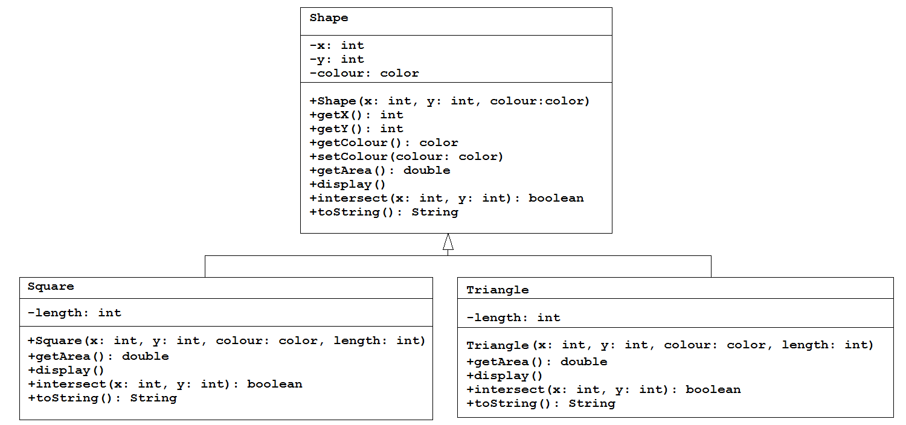

# Java Tutorial #6 - Polymorphism

Topics:

-	Polymorphism
-	Method Overloading
-	instanceof
-	Casting

## Part 1

> There is no **polymorphism** in this part.  Familarise yourself with this code so you can attempt the subsequent parts.

Examine the class hierarchy below for the ``Shape``, ``Square`` and ``Triangle`` classes:

1.	Open and run the program [tut06_01](../code/tutorials/tut06_01/tut06_01.zip?raw=true).  
	
2.	Take a moment to examine all the code.	

3.	Note the output in the console window.  The correct ``display()`` and ``toString()`` methods are being called for each object type - ``Shape``, ``Square`` and ``Triangle``.

4.	Look how ``super()`` is being used in the constructors for ``Square`` and ``Triangle`` **and** in the their ``toString()`` methods.

## Part 2 - Polymorphism 

1.	Open the program [tut06_02](../code/tutorials/tut06_02/tut06_02.zip?raw=true).  

2.	In "PART 2 - Polymorphism" create 3 ``Shape`` objects:

	-	``shape1`` will instantiate a ``Shape`` object at (100, 100) and with a colour white
	-	``shape2`` will instantiate a ``Square`` object at (200, 200), blue, and a length of 100
	-	``shape3`` will instantiate a ``Triangle`` object at (300, 300), red, and a length of 100

	The object types of all shapes will be ``Shape``.  This is valid.

3.	Display and print the details of each of the objects.  A square and triangle should be displayed and details about them are printed in the output window.

> What we've just done is important.  It demonstrates *polymorphism*.  Your code invokes different versions of the ``display()`` and ``toString()`` method at run-time based on what the object shape actually is. That's polymorphism.

## Part 3 - Polymorphism with ArrayLists

1.	Open the program [tut06_03](../code/tutorials/tut06_03/tut06_03.zip?raw=true).  

2.	Above the ``setup()`` method create an ``ArrayList`` called ``shapes`` to store ``Shape`` objects.

3.	In "PART 3 - Polymorphism with ArrayList" create and add the following shapes to the ``shapes`` arraylist:

	-	a ``Square`` object at (200, 200), blue, and a length of 50
	-	a ``Triangle`` object at (300, 300), red, and a length of 50
	-	a ``Triangle`` object at (400, 400), red, and a length of 100

4.	In the ``draw()`` method write a ``for`` loop (enhanced or traditional) to:
	
	-	iterate over the ArrayList 
	-	display each shape
	-	print the details of each shape using ``toString()`` 

> Once more if you've done this correctly you'll have demonstrated polymorphism in action.

## Part 4 - More Polymorphism 

In this part you'll use the left and right mouse buttons to draw squares and triangles at the current mouse position.

1.	Open ``tut06_03`` again.

2.	In the correct blocks of the ``if`` statement in ``mousePressed()`` create and add to the arraylist ``shapes`` the appropriate shapes.  Use the current ``mouseX`` and ``mouseY`` values as the (x,y) coordinates of the shape.  Use any other values for colour and length.

3.	The code written earlier for Part 3 section 5 above should still display the shapes.

4.	Modify the code in the ``draw()`` method ``for`` loop to print the area of any shape that the mouse moves over.  You'll need to use the ``intersect()`` method to do this.

## Part 5 - GAA Score Image Revisited using an ArrayList and Polymorphism

Open and run your solution to the program ``tut05_04`` done in [Tutorial 5](../tutorials/Tutorial5.md).

In your solution ``Point`` and ``Goal`` objects where created and drawn within the ``mousePressed()`` method.  The details of each object were not being stored.  In this part you will modify your code to:

-	create an arraylist to store objects (use the superclass of ``Point`` and ``Goal``)
-	add objects to this arraylist within ``mousePressed()`` for each object created
-	display the objects within the ``draw()`` method

You should be using polymorphism in your solution.

## Part 6 - instanceof & Casting

1.	Open ``tut06_03`` again.

2.	Add the ``Circle`` class from [here](../code/tutorials/tut06_04/Circle.pde) to the project.
	
	Have a brief look at the ``Circle`` class content.  Specifically note the ``getRadius()`` method.

3.	Create and add two circle objects to the ``shapes`` arraylist:

	-	a ``Circle`` object at (400, 400), green, and a radius of 50
	-	a ``Circle`` object at (400, 500), green, and a radius of 50

	Run the code.  The circles should be drawn.

4.	In Part 4 you should have written code to print data about any shape you move the mouse over.  If not, get this done first.

5.	When the mouse moves over a circle attempt to print the *radius* of the shape.

	Remember, your ``ArrayList`` is of type ``Shape`` and you can only invoke methods that are declared in ``Shape``.  Use the ``instanceof`` operator and then cast appropriately to provide the solution needed.

## Exam Revision

Attempt the Week 7 exam questions [here](../notes/Examinations.md).

