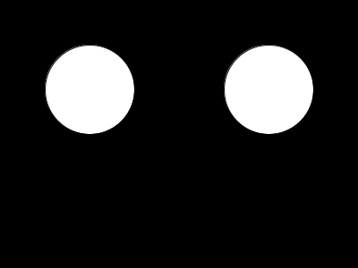

# Java Tutorial #7 

Topics:

-	Abstract Classes 
-	equals() method


By the end of Part 4 you will have a project that runs like this:




## Part 1 - Abstract Classes

> Make sure you've read the notes [here](https://github.com/barcaxi/OOP2017/blob/master/notes/AbstractClasses.md#abstract-classes-1)

1.	Open and run the program [tut07_01](https://github.com/barcaxi/OOP2017/blob/master/code/tutorials/tut07_01/tut07_01.zip?raw=true). Take a moment to examine all the code.


2.	The ``Shape`` class is incomplete because the methods ``getArea()``, ``display()`` and ``intersect()`` are not implemented in ``Shape``.  They are implemented in subclasses like ``Circle``.

	Make those methods and the class ``Shape`` abstract using the ``abstract`` keyword.

3.	You'll get a compilation error in the project file ``tut07_01``.  It states:

	> Cannot instantiate the type ``Shape``

	When you make a class abstract you cannot create an instance of it.  This is what we want.  Comment out that code:

	```java
	// Shape shape1 = new Shape(100, 100, Shape.WHITE);  
	// shape1.display();
	// println(shape1);

	```

4.	Add a new abstract method ``update()`` to the ``Shape`` class:

	```java
	public abstract void update();

	```

	You'll get compilation errors in ``Circle``.  It states:

	> The type ``Circle`` must implement the inherited abstract method ``update()``

5.	Add the method signature and code for ``update()`` to ``Circle``.  Here's the code: 

	```java
	@Override
	public void update()
	{
		if ((getX()>width))
			changeXDirection();
		if ((getY()>height))
			changeYDirection();
		incX(5);
		incY(5);
	}

  	```

  	and modify the ``draw()`` method in the project file ``tut07_01`` to call ``update()`` for each circle:

  	````java
	void draw()
	{  
		background(0);
		circle1.display();  
		circle1.update();  // 
		circle2.display();
		circle2.update();  // 
	}

	```

	Run the code.  You should see the circles move towards the bottom-right area of the window.

6.	You should have noticed how the shapes bounce off the bottom and right bounds of the window but not the top and left bounds.  Fix this.

7.	Finally, notice how half the shape disappears before bouncing.  Fix this so the shape bounces immediately on contact with any bounding side.  


## Part 2 - Overloaded Constructor

1.	Add a new overloaded constructor to ``Circle`` that allows you to specify a colour.  Use this signature:

	```java
	public Circle(int x, int y, color colour, int radius) 

	```

	Add the appropriate code to it.  Make use of the appropriate superclass constructor.

2.	Use the new constructor above when instantiating the ``circle1`` object.  Use the colour constant ``WHITE`` already defined in the ``Shape`` class.


## Part 3 - Setter and Getters

1.	Add to ``Circle`` a setter and getter method for the ``radius`` class variable.

2.	Adjust the size of the radius of each circle by using the ``UP`` and ``DOWN`` arrow keys.  Add the appropriate code to the ``keyPressed()`` method given in the project file ``tut07_01``.


3.	If you hold down the ``DOWN`` arrow key you'll notice a strange thing happen after the circles disappear.  They'll start to reappear again.  Prevent this happening by modifying the code in ``setRadius()``. 


## Part 4 - ``equals()`` method

> Make sure you've read the notes [here](https://github.com/barcaxi/OOP2017/blob/master/notes/AbstractClasses.md#equals-method)


1.	In the ``draw()`` method after the circles are displayed use the ``intersects()`` method in ``Circle`` to determine if the two circles intersect each other at some point in time.  If they do print a simple message like "intersects".  Use this code:

	```java
	if(????????)
	{
		// 2 circles intersected
		print("intersects...");
	}

	```

2.	Each time the circles do intersect reduce the radius of each circle by 1.  Test it works.

3.	Write a ``equals()`` method for ``Circle`` so we can compare circles.  For simplicity, assume two circles are equal if they have the same ``radius`` value.  Don't consider the (x,y) values.

4.	In ``setup()`` after the code that instantiates both circles test if both circles are equal.  Print a simple message like "circle1 equals circle2".

5.	In ``draw()``, only if both circles intersect *and* are equal should you reduce the radius of each circle by 1.  Test this with circles that have the same radius **and** with circles that have different radius values.

6.	If both circles intersect and are equal change the colour of each circle to red otherwise the colour should remain white.  Make use of the colour constants already defined in the ``Shape`` class.

7.	Finally, if both circles radiuses are 0 then exit the program.  Use the ``exit()`` statement:

	```java
	exit();

	```


## Part 5 - ``Person`` class ``equals()`` method

1.	Open and run the program [tut07_02](https://github.com/barcaxi/OOP2017/blob/master/code/tutorials/tut07_02/tut07_02.zip?raw=true).  

2.	The code in *Part (a)* does not work as you'd expect.  The contents of objects ``person1`` and ``person2`` are equal, but no ``equals()`` method was overriden in ``Person``.  Provide the ``equals()`` method needed in ``Person`` that compares each of the class variables ``firstName``, ``lastName`` and ``age``.

3.	Run the program again and you should now see the expected output.  They are equal because the contents of their class variables are the same.

4.	Note the output in *Part (b)*.  

	``==`` compares what the object references are pointing to.

	These object references cannot be equal.  They are pointing to 2 different objects.

5.	Note the output in *Part (c)*.  These object references are now equal because they are pointing to the same object.

Make sure you understand this code.  It is explained [here](https://github.com/barcaxi/OOP2017/blob/master/notes/AbstractClasses.md#equals-method).


## Part 6 - Additional Exercises

1.	In ``setup()`` after the code that instantiates the circle ``circle1`` change its x and y direction immediately using the ``Shape`` class methods ``changeXDirection()`` and ``changeYDirection()``.  Run your code to see new effect.

2.	Try to get both circles to bounce off each other when they intersect.  Add the appropriate into your ``draw()`` method.

3.	Create a copy of your ``tut07_01`` project folder.  You'll modify it's code significantly in the following exercises.  It may be useful to have a copy of it.

4.	In ``tut07_01`` add an arraylist called ``circles`` to store ``Circle`` objects.
	
5.	Add ``circle1`` and ``circle2`` to the arraylist.

6.	Modify ``draw()`` so the code looks like this:

	```java
	void draw()
	{  
		background(0);

		for (Circle c : circles)
		{
			c.display();
			c.update();
		}
	}

	```

	You'll be losing a lot of existing code, but you have a copy (don't you?).
	
7.	Add a ``mousePressed()`` method to ``tut07_01``:

	```java
	void mousePressed()
	{
		
	}

	```

8.	When the mouse is pressed create an new ``Circle`` object that uses the current mouse (x, y) coordinates and a radius of 50, and add it to the ``circles`` arraylist.  Test your code.  You should be able to add lots of circles that bounce around the window.


9.	Attempt to get all circles to bounce off each other when they intersect.  Add the appropriate into your ``draw()`` method.

10.	Finally, modify the ``display()`` method in ``Circle`` to this:

	```java
	@Override
	public void display()
	{    
		fill(getColour(), 50);
		ellipse(getX(), getY(), radius*2, radius*2);
		ellipse(getX()-20, getY()-20, 10, 10);
	} 

	```


## Exam Revision

Attempt the Week 8 exam question(s) [here](../notes/Examinations.md).
