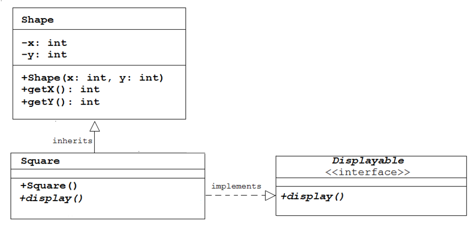

# Java Tutorial #8 - Interfaces

Topics:

-	``Comparable`` interface
-	``Comparator`` interface
-	User-Defined interfaces


## Part 1 - ``Comparable`` Interface

> Make sure you've read the notes [here](https://github.com/barcaxi/OOP2017/blob/master/notes/Interfaces.md)

1.	Open and run the program [tut08_01](https://github.com/barcaxi/OOP2017/blob/master/code/tutorials/tut08_01/tut08_01.zip?raw=true). Take a moment to examine all the code and the output.

	The ``String`` class has a ``compareTo()`` method that implements the interface ``Comparator``.  See the documentation [here](https://docs.oracle.com/javase/7/docs/api/java/lang/String.html).  In this code we call it directly to compare strings.

2.	Swap the values of ``s1`` and ``s2`` and rerun the code.  Understand the output. 

3.	Open and run the program [tut08_02](https://github.com/barcaxi/OOP2017/blob/master/code/tutorials/tut08_02/tut08_02.zip?raw=true). Take a moment to examine all the code and the output.

	The static method ``sort()`` in the ``Collections`` class sorts the strings in our arraylist.  In fact, the ``sort()`` method **depends upon** our arraylist objects implementing the ``Comparable`` interface and implementing the ``compareTo()`` method.  The Java ``String`` class does this for us as we seen earlier.

4.	Many other Java classes implement the ``Comparable`` interface like wrapper classes ``Integer``, ``Double``, ``Character``, etc.  

	Open the program [tut08_03](https://github.com/barcaxi/OOP2017/blob/master/code/tutorials/tut08_03/tut08_03.zip?raw=true). 

	Create an arraylist of ``Integer`` objects and add the following numbers to the arraylist:

	10, 6, 8, 4

	Then sort the arraylist and print the result.  They should be sorted.  

	Again, this works because ``Integer`` also implements the ``Comparable`` interface.  See [here](https://docs.oracle.com/javase/7/docs/api/java/lang/Integer.html).


## Part 2 - ``Comparable`` Interface for ``Circle`` Class

Let's attempt to use the ``sort()`` method to sort circle objects by their radius values.

1.	Open and run the program [tut08_04](https://github.com/barcaxi/OOP2017/blob/master/code/tutorials/tut08_04/tut08_04.zip?raw=true). 

2.	Notice the numbers within the circles indicates the sequence the circles are displayed.  They are displayed in the order they are retrieved from the arraylist.

3.	Add these two lines of code at the end of the ``setup()`` method:

	```java
	java.util.Collections.sort(circles);
  	println("Sorted :"+circles);

	```

	A compiler error indicates something is missing in order to sort the circles.  

4.	Provide the required changes to sort the circles by radius values.  You'll need to:

	-	implement the ``Comparable`` interface
	-	write/implement the appropriate ``compareTo()`` method that compares radiuses.

	This diagram demonstrates what you need to do:

	

	You should refer to the notes [here](https://github.com/barcaxi/oop/blob/master/notes/Interfaces.md)


## Part 3 - ``Comparable`` Interface for ``Triangle`` Class

This time sort some triangles by their length values.

1.	Open the program [tut08_05](https://github.com/barcaxi/OOP2017/blob/master/code/tutorials/tut08_05/tut08_05.zip?raw=true). 

2.	Provide the required changes to sort the triangle by length values.

	When it runs it should look like this:

	


## Part 4 - Sorting Cards

Let's revisit a previous cards program and sort cards by value.

1.	Open the program [tut08_06](https://github.com/barcaxi/OOP2017/blob/master/code/tutorials/tut08_06/tut08_06.zip?raw=true). 

2.	Provide the required changes to sort the cards by value.


## Part 5 - ``Comparator`` Interface

1.	Open your solution to the program ``tut08_04``

2.	Provide the required changes to sort the circles by their ``x`` coordinate value.  You need to implement the ``Comparator`` interface for the class ``XComparator``.  Your ``setup()`` will look like this:

	```java
	void setup()
	{
	  size(800, 600);
	  circles = new ArrayList<Circle>();
	  circles.add(new Circle(100, 300, 50));
	  circles.add(new Circle(200, 200, 40));
	  circles.add(new Circle(300, 100, 30));

	  // sort circles by their x coordinate value
	  java.util.Collections.sort(circles, new XComparator());
	  
	}

	```

	and the output should look like this:

	


3.	Provide the necessary modifications to ``tut08_04`` to allow sorting circles by their ``y`` coordinate value too.  When done, this command at the end of ``setup()`` should sort circle by the ``y`` value:

	```java
	// sort circles by y coordinate value
	java.util.Collections.sort(circles, new YComparator());

	```

## Part 6 - Sorting Cards by Suit

In playing cards, a *suit* is a category into which the cards of a deck are divided. The four suits are Hearts, Spades, Clubs, and Diamonds.  Each suit has 13 cards - Ace, 2 to 10, Jack, Queen, King.

Let's try to sort cards by suit not value as you did previously.


1.	Open the program [tut08_07](https://github.com/barcaxi/OOP2017/blob/master/code/tutorials/tut08_07/tut08_07.zip?raw=true). 

2.	You will provide the required changes to **sort the cards by suit**.  

3.	Look a the ``deal()`` method in the ``Cards`` class.  You'll see cards being sorted by value using the ``Comparable`` interface.

4.	Uncomment the line:

	```java
	//java.util.Collections.sort(cards, new SuitComparator());

	```

	and make this work by creating the class ``SuitComparator`` that implements the ``Comparator`` interface.  

	When it runs it should short cards by suit like this:

		


## Part 7 - User-Defined Interface ``Displayable``

In the [notes](https://github.com/barcaxi/OOP2017/blob/master/notes/Interfaces.md#user-defined-interfaces) we talked about using interfaces to define *what an object can do* but not specifying how to do it.  One of the things a shape like ``Square`` does is display itself on the screen.  We could write an interface that will have an object like ``Square`` implement the display action/behaviour.

Let's use an interface called ``Displayable`` that looks like this:

```java
public interface Displayable
{
  public void display();
}


```

and have the ``Square`` class implement it like this:

```java
public class Square extends Shape implements Displayable
{
  ...
  ...

  // a Processing specific implementation of display()
  public void display()
  {
    rect(getX(), getY(), length, length);
  }
}

```

In ``Square`` we've implemented the behaviour promised in the interface ``Displayable``.  

**The interface defines what something displayable must do and the class specifies how we do it**.

So, we have this:

	


### Implement ``Displayable``

To illustrate one of the purposes of interfaces let's use the ``Shape``, ``Square`` and ``Displayable`` code above to draw a square firstly using *Processing* and then using *jGrasp*.

**Processing**

1.	Download the code in [tut08_08Processing](https://github.com/barcaxi/OOP2017/blob/master/code/tutorials/tut08_08Processing/tut08_08Processing.zip?raw=true). 

2.	Notice how ``Square`` implements ``Displayable`` and overrides the method ``display()``

3.	Provide the Processing code to draw the square and run your code to test it works.  You should see this:

			


**jGrasp**

1.	Download the code in [tut08_08jGrasp](https://github.com/barcaxi/OOP2017/blob/master/code/tutorials/tut08_08jGrasp/tut08_08jGrasp.zip?raw=true). 

2.	Notice how ``Square`` implements ``Displayable`` and overrides the method ``display()``

3.	Provide the code to draw the square using asterisks and run your code to test it works.  You should see this for a square with a length of 5:

	```
	*****
	*   *
	*   *
	*   *
	*****

	```

	You may have to change the length of the square when instantiating the ``Square`` object.


> **What you've done here is a powerful feature of interfaces.  The interface specified something can be displayable and you determined how to display it.  Interfaces tell you what to do, you determine how to do it.**


## Part 8 - User-Defined Interface ``Resizable``

Using ``tut08_08Processing`` provide the necessary code to implement the ``Resizable`` interface shown in the [notes](https://github.com/barcaxi/OOP2017/blob/master/notes/Interfaces.md)


## Exam Revision

Attempt the Week 9 exam question(s) [here](../notes/Examinations.md).


